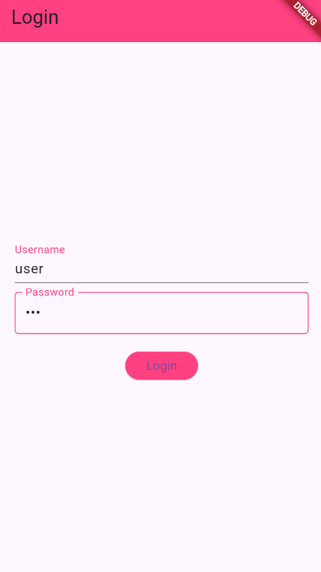
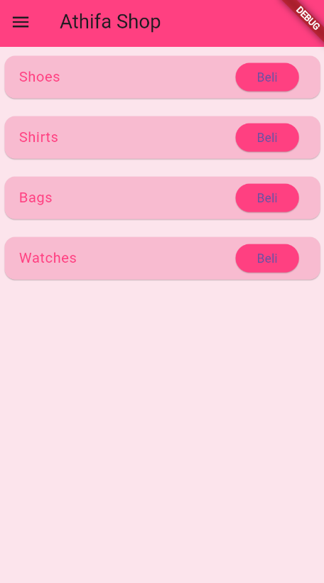
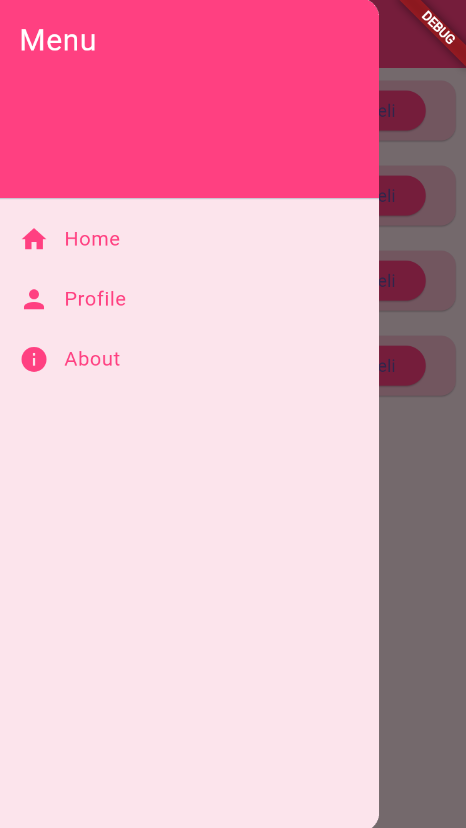
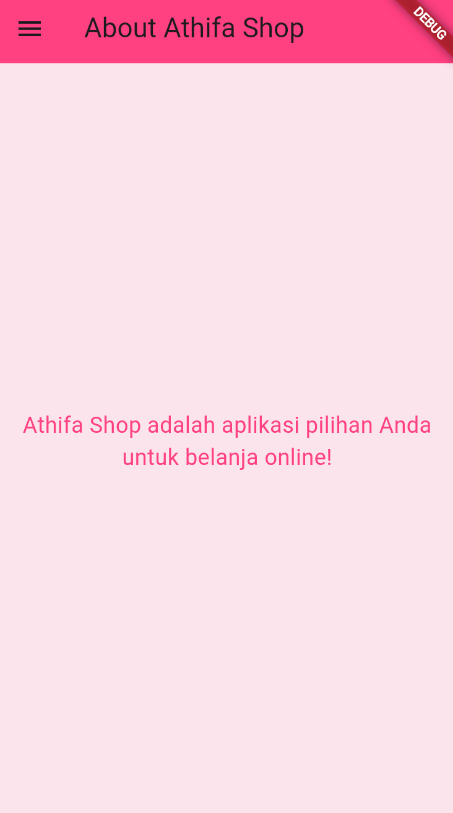
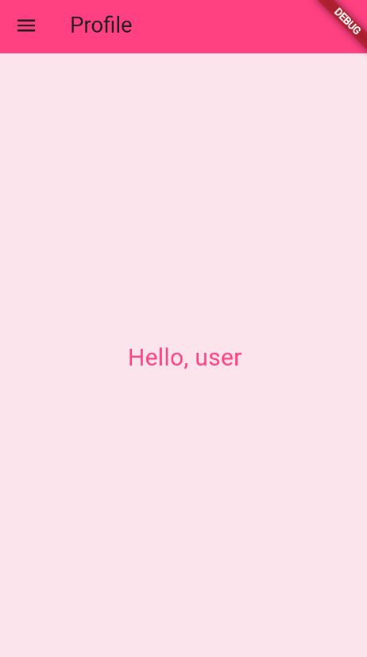

# Athifa Shop
**Nama**       : Athifa Nathania  
**NIM**        : H1D022031  
**Shift Baru** : F
**Shift Lama** : D

**Athifa Shop** adalah aplikasi belanja online yang dikembangkan menggunakan Flutter. Aplikasi ini mencakup fitur login dengan validasi sederhana, navigasi berbasis **routes**, **side menu**, dan penyimpanan data menggunakan **local storage** dengan SharedPreferences.

## Fitur Utama
1. **Login**: Pengguna dapat login menggunakan username dan password (`user` dan `123`).
2. **Side Menu**: Menu navigasi yang menyediakan akses cepat ke halaman `Home`, `Profile`, dan `About`.
3. **Local Storage**: Penyimpanan username menggunakan **SharedPreferences** untuk menampilkan profil pengguna setelah login.
4. **Navigasi**: Menggunakan Flutter's `Navigator` dengan route management untuk perpindahan antar halaman.
5. **Product List**: Menampilkan daftar produk di halaman `Home` dengan opsi pembelian.

## Struktur Aplikasi
- **`main.dart`**: Entry point dari aplikasi. Mengatur route ke halaman login, home, profile, dan about.
- **`login_page.dart`**: Halaman untuk login pengguna. Jika login berhasil, aplikasi akan menyimpan username menggunakan SharedPreferences dan berpindah ke halaman Home.
- **`home_page.dart`**: Halaman utama yang menampilkan daftar produk menggunakan `ListView.builder`. Terdapat fitur pembelian produk (dummy).
- **`about_page.dart`**: Halaman yang menampilkan informasi tentang aplikasi.
- **`profile_page.dart`**: Halaman profil yang memuat nama pengguna yang disimpan setelah login.
- **`side_menu.dart`**: Komponen side menu yang memudahkan navigasi antar halaman.
- **`product_card.dart`**: Komponen card untuk menampilkan informasi produk di halaman `Home`.

## Screenshot Aplikasi






## Penjelasan Kode
### 1. Login Page
```dart
void _login() async {
  final prefs = await SharedPreferences.getInstance();
  if (_usernameController.text == 'user' &&
      _passwordController.text == '123') {
    await prefs.setString('username', _usernameController.text);
    Navigator.pushReplacementNamed(context, '/home');
  } else {
    ScaffoldMessenger.of(context).showSnackBar(
      const SnackBar(content: Text('Username atau Password salah')),
    );
  }
}
```
Penjelasan:
- Fungsi `_login` digunakan untuk memproses login pengguna.
- `SharedPreferences` digunakan untuk menyimpan username setelah login berhasil.
- Jika username dan password sesuai (`user` dan `123`), username disimpan di local storage, dan pengguna diarahkan ke halaman `Home`.
- Jika gagal, akan ditampilkan notifikasi menggunakan `SnackBar`.

### 2. Home Page
```dart
final List<String> products = const ['Shoes', 'Shirts', 'Bags', 'Watches'];

@override  
Widget build(BuildContext context) {
  return Scaffold(
    appBar: AppBar(
      title: const Text('Athifa Shop'),
      backgroundColor: Colors.pinkAccent,
    ),
    drawer: const SideMenu(),
    body: Container(
      color: Colors.pink[50],
      child: ListView.builder(
        itemCount: products.length,
        itemBuilder: (context, index) {
          return ProductCard(productName: products[index]);
        },
      ),
    ),
  );
}
```
Penjelasan:
- Halaman ini menampilkan daftar produk berupa `Shoes`, `Shirts`, `Bags`, dan `Watches`.
- Produk ditampilkan menggunakan `ListView.builder` yang memetakan setiap item ke dalam komponen `ProductCard`.
- Aplikasi menggunakan `SideMenu` untuk navigasi.

### 3. Product Card
```dart
class ProductCard extends StatelessWidget {
  final String productName;

  const ProductCard({required this.productName, Key? key}) : super(key: key);

  @override
  Widget build(BuildContext context) {
    return Card(
      color: Colors.pink[100],
      margin: const EdgeInsets.all(10),
      child: ListTile(
        title: Text(productName, style: const TextStyle(color: Colors.pinkAccent)),
        trailing: ElevatedButton(
          onPressed: () {},
          style: ElevatedButton.styleFrom(backgroundColor: Colors.pinkAccent),
          child: const Text('Beli'),
        ),
      ),
    );
  }
}
```
Penjelasan:
- `ProductCard` digunakan untuk menampilkan nama produk di dalam komponen kartu (`Card`).
- Terdapat tombol `Beli` di bagian kanan setiap kartu produk, namun saat ini belum memiliki fungsi lebih lanjut.

### 4. Profile Page
```dart
void _loadUsername() async {
  final prefs = await SharedPreferences.getInstance();
  setState(() {
    username = prefs.getString('username');
  });
}

@override
Widget build(BuildContext context) {
  return Scaffold(
    appBar: AppBar(
      title: const Text('Profile'),
      backgroundColor: Colors.pinkAccent,
    ),
    drawer: const SideMenu(),
    body: Container(
      color: Colors.pink[50],
      child: Center(
        child: Text(
          username != null ? 'Hello, $username' : 'Loading...',
          style: const TextStyle(fontSize: 24, color: Colors.pinkAccent),
        ),
      ),
    ),
  );
}
```
Penjelasan:
- Fungsi `_loadUsername` mengambil data username yang disimpan di `SharedPreferences` saat pengguna login.
- Setelah username berhasil diambil, ditampilkan dalam teks "Hello, [username]" di halaman `Profile`.
- Jika username belum termuat, teks yang ditampilkan adalah "Loading...".

### 5. Side Menu
```dart
Drawer(
  child: Container(
    color: Colors.pink[50],
    child: ListView(
      children: [
        const DrawerHeader(
          decoration: BoxDecoration(color: Colors.pinkAccent),
          child: Text('Menu', style: TextStyle(color: Colors.white, fontSize: 24)),
        ),
        ListTile(
          leading: const Icon(Icons.home, color: Colors.pinkAccent),
          title: const Text('Home', style: TextStyle(color: Colors.pinkAccent)),
          onTap: () => Navigator.pushReplacementNamed(context, '/home'),
        ),
        ListTile(
          leading: const Icon(Icons.person, color: Colors.pinkAccent),
          title: const Text('Profile', style: TextStyle(color: Colors.pinkAccent)),
          onTap: () => Navigator.pushReplacementNamed(context, '/profile'),
        ),
        ListTile(
          leading: const Icon(Icons.info, color: Colors.pinkAccent),
          title: const Text('About', style: TextStyle(color: Colors.pinkAccent)),
          onTap: () => Navigator.pushReplacementNamed(context, '/about'),
        ),
      ],
    ),
  ),
);
```
Penjelasan:
- `SideMenu` adalah komponen drawer yang berfungsi sebagai menu samping.
- Menu ini menyediakan navigasi ke halaman `Home`, `Profile`, dan `About` menggunakan `Navigator.pushReplacementNamed` untuk mengganti halaman saat menu ditekan.

### 6. main.dart
```dart
return MaterialApp(
  title: 'Athifa Shop',
  theme: ThemeData(primarySwatch: Colors.blue),
  initialRoute: '/login',
  routes: {
    '/login': (context) => const LoginPage(),
    '/home': (context) => const HomePage(),
    '/profile': (context) => const ProfilePage(),
    '/about': (context) => const AboutPage(),
  },
);
```
Penjelasan:
- Ini adalah entry point aplikasi yang mengatur route dan halaman awal (`/login`).
- Menggunakan `routes` untuk mengatur navigasi ke berbagai halaman, seperti login, home, profile, dan about.
